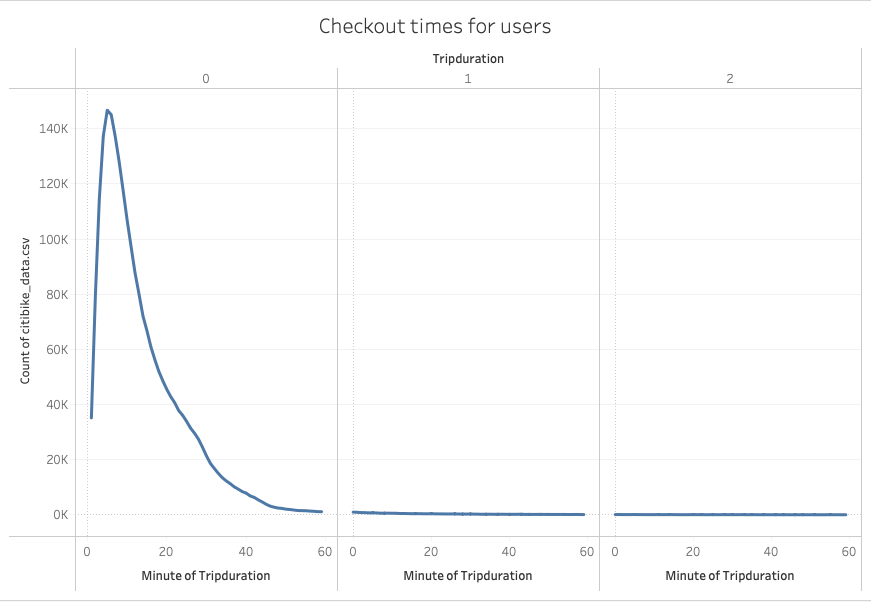
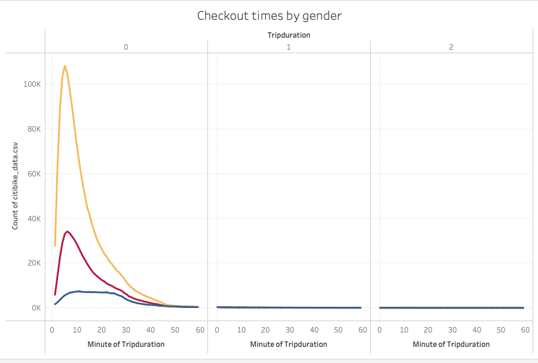
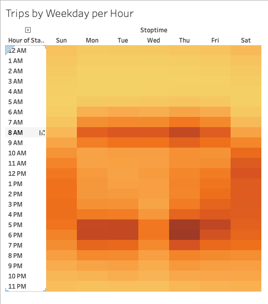
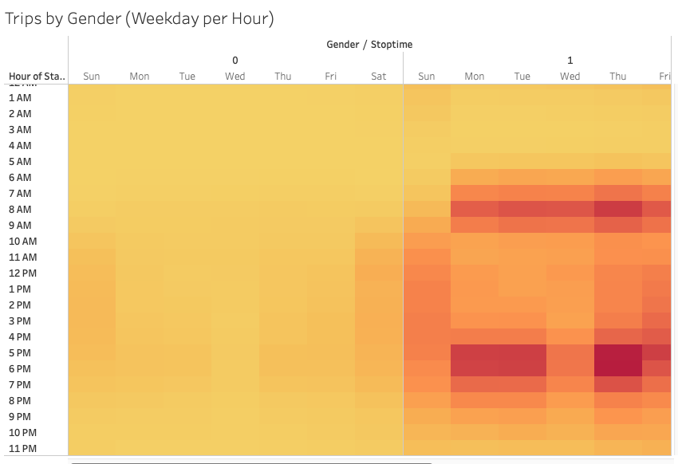
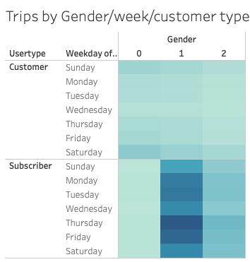
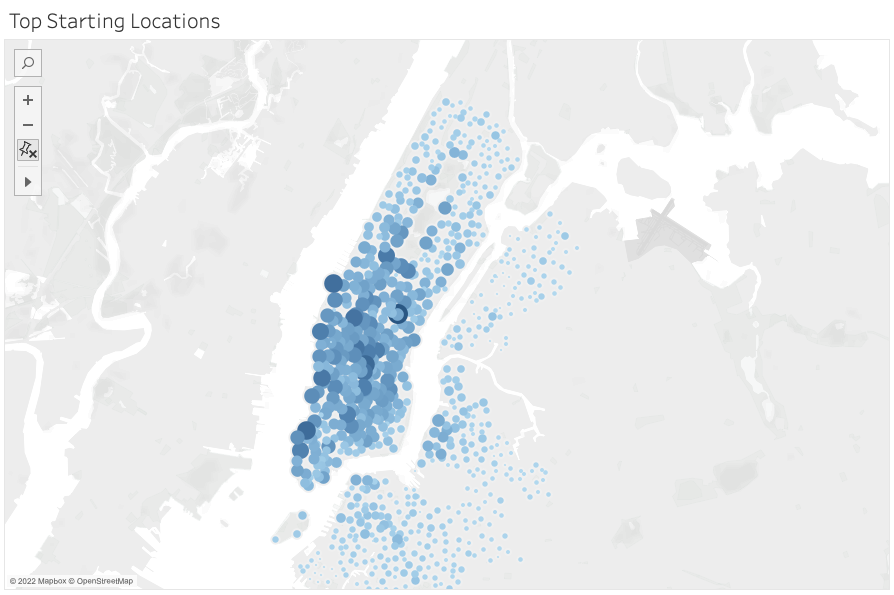
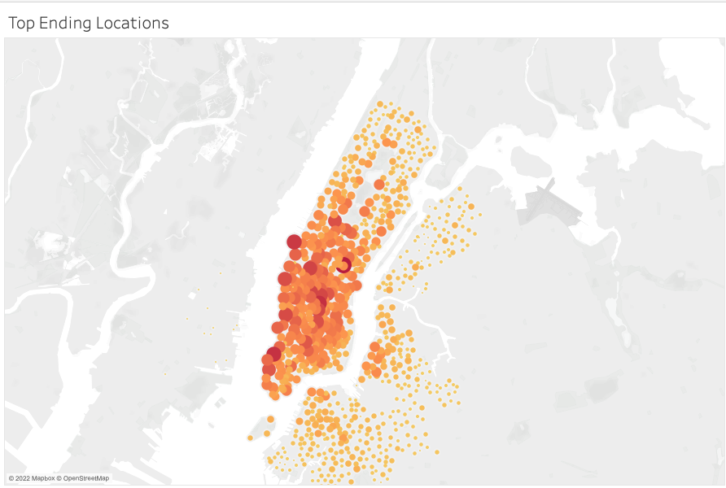

# BikeSharing

## Purpose

The purpose of this project is to analyze the performance of the NYC Citibike service. The challenge specifically analyzes the trip duration and use per week of users by gender and by user type (subscriber and non-subscriber).

## Results

The Tableau workbook displaying the results of the challenge materials can be found at [this link](https://public.tableau.com/app/profile/abigail.amick/viz/NYC-Citibike-Challenge_16550644196510/Story?publish=yes "link to story").

The following two images show the duration of rented bike trips first regardless of gender and then considering gender.

The image below shows the popularity of bike trips across all users each hour in the day, each day of the week.

The images below elaborate on the above heatmap by showing the same data separated by gender and subsequently by user type.

The two images below show the most popular starting and ending locations for trips.

## Summary

These visualizations clearly display the most popular locations and times of bike use. NYC Citibike can use this to inform their placement of available bikes, advertising, timing of repairs, and number of bikes at given locations. Other aspiring bike rental companies can use this information to inform their initial business plan.
